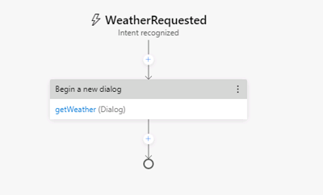

---
lab:
    title: '使用 Bot Framework Composer 创建机器人'
    module: '模块 7 - 对话式 AI 和 Azure 机器人服务'
---

# 使用 Bot Framework Composer 创建机器人

Bot Framework Composer 是一种图像设计器，可用于快速轻松地构建复杂的对话机器人，而无需编写代码。Composer 是一种开源工具，提供了一个用于构建机器人的可视化画布。

## 获取 OpenWeather API 密钥

在此练习中，你将创建一个机器人，用于根据用户输入的邮政编码检索天气状况。你需要具有 API 密钥才可使用该服务。

1. 在 Web 浏览器中，转到 OpenWeather 站点 (`https://openweathermap.org/price`).
2. 请求免费的 API 密钥，并创建一个 OpenWeather 帐户（如果你还没有该帐户）。
3. 注册后，在“**API 密钥**”页面查看你的 API 密钥。

## 创建机器人

现在，你已准备好使用 Composer 来创建机器人。

### 创建机器人，并自定义“欢迎”对话流

1. 启动 Bot Framework Composer。

    **备注**：Bot Framework Composer 会定期更新。如果系统提示你安装更新，请为当前登录的用户完成该操作。更新可能包括更改用户界面，这可能会影响此练习中的说明。

2. 在“**开始**”屏幕上，选择“**新建**”。然后从头开始创建新机器人，将其命名为“**WeatherBot**”并保存在本地文件夹中。
3. 在左侧的导航窗格中，选择“**问候语**”，以打开创作画布并显示用户最初加入与机器人的对话时调用的“*ConversationUpdate*”活动。该活动包含一系列操作。
4. 在右侧的属性窗格中，通过选择窗格顶部的“**问候语**”一词编辑“**问候语**”的标题，将其更改为“**WelcomeUsers**”。
5. 在创作画布中，选择“**发送响应**”操作。然后，在属性窗格中，将“**语言生成**”框中的默认文本从 *- ${WelcomeUser()}* 更改为“`- Hi! I'm WeatherBot.`”（包括前面的短划线“-”）。
6. 在创作画布中，选择最后的“**+**”号（位于标记对话流<u>结尾</u>的圆圈正上方），并添加新的“**提问**”操作以获取**文本**响应。

    新的操作将在对话流中创建两个节点。第一个节点定义一个提示，供机器人用于向用户提问，第二个节点表示将从客户处收到的响应。在属性窗格中，这些节点具有相应的“**机器人提问**”和“**用户输入**”选项卡。

7. 在属性窗格中的“**机器人提问**”选项卡上，将“**提示输入文本**”值设置为“`- What's your name?`”。然后，在“**用户输入**”选项卡上，将“**属性**”值设置为“`user.name`”，以定义你稍后可在机器人对话中访问的变量。
8. 返回到创作画布，选择你刚刚添加的“**用户输入(文本)**”操作下的“**+**”号，并添加“**发送响应**”操作。
9. 选择新添加的“**发送响应**”操作，并在属性窗格中将“**语言生成**”的值设置为“`- Hello ${user.name}, nice to meet you!`”。

    完成的活动流应如下所示：

    

### 测试机器人

你的基本机器人已创建完毕，现在我们来对其进行测试。

1. 选择 Composer 右上角的“**启动机器人**”，然后等待机器人完成编译并启动。此操作可能需要几分钟。

    - 如果出现 Windows 防火墙消息，请针对所有网络启用访问权限。

2. 在“**本地机器人运行时管理器**”窗格中，选择“**在 Emulator 中测试**”。然后等待 Bot Framework Emulator 启动。
3. 在 Bot Framework Emulator 中，你可在短暂的暂停后看到欢迎消息，以及要求你输入自己名字的提示。  输入你的名字，然后按 **Enter**。
4. 机器人应该会回应“**Hello *your_name*, nice to meet you!**”。
5. 关闭 Emulator。
6. 在 Composer 的“**本地机器人运行时管理器**”窗格中，使用 ⏹ 图标停止机器人。

## 添加一个对话以获取天气信息

现在你已经有了一个可正常工作的机器人，可以通过添加用于特定交互的对话来扩展其功能。在本例中，你将添加当用户提到“weather”时触发的对话。

### 添加对话

首先，你需要定义用于处理天气相关问题的对话流。

1. 在 Composer 的导航窗格中，将鼠标悬停在顶级节点（“**WeatherBot**”）上方，然后在 **&#8285;** 菜单中选择“**+ 添加对话**”，如下所示：

    

    然后创建名为“**getWeather**”的新对话，并添加描述“**根据提供的邮政编码获取当前天气状况**”。
2. 在导航窗格中，选择新的“**getWeather**”对话的“**BeginDialog**”节点。然后在创作画布上使用“**+**”号添加“**提问**”操作，以获取**文本**响应。
3. 在属性窗格中的“**机器人提问**”选项卡上，将“**提示输入文本**”值设置为“`- Enter your zipcode.`”。
4. 在“**用户输入**”选项卡上，将“**属性**”字段设置为“`user.zipcode`”，并将“**输出格式**”字段设置为表达式 `=trim(this.value)`，以删除用户提供的值中任何不必要的空格。
5. 在“**其他**”选项卡上设置以下值，以便为输入的邮政编码定义验证规则：
    - 在“**识别器**”区域中，将“**未识别的提示**”字段设置为“`- Sorry the value '${this.value}' doesn't appear to be a valid entry.  Please enter a zip code in the form of 12345.`”。
    - 在“**验证**”部分中，添加验证规则 `length(this.value) == 5`，以检查所输入邮政编码的长度是否刚好是 5 个字符。然后将“**无效提示**”字段设置为“`- Sorry, '${this.value}' is not valid. I'm looking for a 5-digit number as zip code. Please specify a zip code in the form 12345.`”。
    - 在“**提示配置**”部分中，将“**默认值**”属性设置为“`98052`”。

        默认情况下，提示配置为要求用户提供“*最大轮次数*”信息（默认为 3）。达到最大轮次数时，提示将停止，并且属性将设置为“**默认值**”字段中定义的值，然后再继续对话。

    到目前为止，活动流应该如下所示：

    

    到目前为止，对话已要求用户输入邮政编码，并已验证用户输入。现在必须实现根据所输入的邮政编码来检索天气信息的逻辑。

6. 在创作画布上，在获取用户输入的邮政编码的“**用户输入**”操作正下方，选择“**+**”号以添加新操作。
7. 从操作列表中依次选择“**访问外部资源**”和“**发送 HTTP 请求**”。
8. 按如下所示设置“**HTTP 请求**”的属性，将“**YOUR_API_KEY**”替换为你的 [OpenWeather](https://openweathermap.org/price) API 密钥：
    - **HTTP 方法**： GET
    - **URL**： `http://weatherbot-ignite-2019.azurewebsites.net/api/getWeather?zipcode=${user.zipcode}&api_token=YOUR_API_KEY`
    - **结果属性**： `dialog.api_response`

    结果可能包含 HTTP 响应中以下四个属性中的任何一个：

    - **statusCode**。通过 **dialog.api_response.statusCode** 访问。
    - **reasonPhrase**。通过 **dialog.api_response.reasonPhrase** 访问。
    - **content**。通过 **dialog.api_response**.content 访问。
    - **headers**。通过 **dialog.api_response.headers** 访问。

    此外，如果响应类型为 JSON，则其将是可通过 **dialog.api_response.content** 属性获取的反序列化对象。

    现在需要向处理响应的对话流添加逻辑，该响应可指示 HTTP 请求是成功还是失败。

9. 在创作画布上，在你创建的“**发送 HTTP 请求**”操作下方添加“**创建条件**” > “**分支：if/else**”操作。此操作在对话流中定义了一个包含“**True**”和“**False**”路径的分支。
10. 在分支操作的“**属性**”中，将“**条件**”字段设置为以下表达式：

    ```
    =dialog.api_response.statusCode == 200
    ```

11. 如果调用成功，则需要在一个变量中存储响应。在创作画布上，在“**True**”分支中添加“**管理属性**” > “**设置属性**”操作。然后在属性窗格中，按如下所示设置“**设置属性**”操作的属性：
    - **属性**： `dialog.weather`
    - **值**： `=dialog.api_response.content`

12. 仍然是在“**True**”分支中，在“**设置属性**”操作下添加“**发送响应**”操作，并将其“**语言生成**”文本设置为：

    ```
    - The weather in ${dialog.weather.city} is ${dialog.weather.weather} and the temp is ${dialog.weather.temp}&deg;.
    ```

13. 你还需考虑天气服务的响应并非 200 的情况，因此，在“**False**”分支中添加“**发送响应**”操作，并将其“**语言生成**”文本设置为“`- I got an error: ${dialog.api_response.content.message}.`”

    对话流现在应如下所示：

    


14. 最后，你需要重置邮政编码变量，使用户可在下次查看天气时输入替代位置。在“**If/Else**”分支后面，选择最后一个“**+**”号，添加“**管理属性**” > “**删除属性**”操作，并将其“**属性**”字段设置为“`user.zipcode`”。

    已完成的活动流应如下图所示：

    

### 为对话添加触发器

现在需要通过某种方式从现有欢迎对话中启动新对话。

1. 在导航窗格中，选择包含“**WelcomeUsers**”（位于同名的顶级机器人节点下）的“**WeatherBot**”对话。

    

2. 在所选“**WeatherBot**”对话的属性窗格中，将“**语言理解**”部分中的“**识别器类型**”设置为“**正则表达式识别器**”。

    > 默认识别器类型使用“语言理解”服务，通过自然语言理解模型来表达用户意向。我们将使用正则表达式识别器来简化此练习。在实际应用程序中，你应该考虑使用语言理解来实现更复杂的意向识别。

3. 在“**WeatherBot**”对话的 **&#8285;** 菜单中，选择“**添加触发器**”。

    

    然后使用以下设置创建一个触发器：

    - **此触发器的类型是什么？**：已识别的意向
    - **此触发器 (RegEx) 的名称是什么**： `WeatherRequested`
    - **请输入正则表达式模式**： `weather`

    > 在正则表达式模式文本框中输入的文本是一个简单的正则表达式模式，它会让机器人在任何传入消息中查找“*weather*”一词。  如果存在“weather”一词，则消息成为“**已识别的意向**”，并启动触发器。 

4. 触发器已创建完毕，现在需要为它配置一个操作。在触发器的创作画布中，选择新的“**WeatherRequested**”触发器节点下的“**+**”号。然后在操作列表下依次选择“**对话管理**”和“**开始新对话**”。
5. 选择“**开始新对话**”操作后，从属性窗格的“**对话名称**”下拉列表中选择“**getWeather**”对话，以启动在之前识别出“**WeatherRequested**”触发器时定义的“**getWeather**”对话。

    **WeatherRequested** 活动流应如下所示：

    

6. 重启机器人并在 Bot Framework Emulator 中对其进行测试。等待机器人发出问候语，并在输入你的姓名后输入 `What is the weather like?`。然后在收到提示时输入有效的美国邮政编码，如 `98004`。机器人将与相关服务联系，并通过一份简短的天气报告声明做出回应。
7. 完成此测试后，关闭 Emulator 并停止机器人。

## 处理中断

设计良好的机器人应允许用户更改对话流（例如，通过更改请求）。

1. 在 Bot Composer 的导航窗格中，使用“**WeatherBot**”对话的 **&#8285;** 菜单添加新的触发器（除了现有的“**WelcomeUsers**”和“**WeatherRequested**”触发器之外）。新触发器应采用以下设置：

    - **此触发器的类型是什么？**：已识别的意向
    - **此触发器 (RegEx) 的名称是什么**： `CancelRequest`
    - **请输入正则表达式模式**： `cancel`

    > 在正则表达式模式文本框中输入的文本是一个简单的正则表达式模式，它会让机器人在任何传入消息中查找“*cancel*”一词。

2. 在触发器的创作画布中，添加“**发送响应**”操作，并将其“**语言生成**”属性设置为“`- OK.Whenever you're ready, you can ask me about the weather.`”
3. 在“**发送响应**”操作下，通过选择“**对话管理**”和“**结束此对话**”向对话添加新操作。

    **CancelRequest** 活动流应如下所示：

    

    现在已经有了响应用户取消请求的触发器，接下来必须允许在用户可能想要发出此类请求的位置中断对话流（例如在客户请求天气信息后提示用户输入邮政编码时）。

4. 在导航窗格中，选择“**getWeather**”对话下的“**BeginDialog**”节点。
5. 选择“**提示输入文本**”操作，要求用户输入其邮政编码。
6. 在该操作的属性窗格中，在“**其他**”选项卡上展开“**提示配置**”，并将“**允许中断**”属性设置为“**True**”。
7. 重启机器人并在 Bot Framework Emulator 中对其进行测试。等待机器人发出问候语，并在输入你的姓名后输入“What is the weather like?”。然后在出现提示时输入 `cancel`，并确认请求已取消。
8. 在取消请求后，输入 `What's the weather like?`，并注意相应的触发器启动了新的 **getWeather** 对话实例，再次提示你输入邮政编码。
9. 完成此测试后，关闭 Emulator 并停止机器人。

## 增强用户体验

到目前为止，与机器人的交互都是通过文本进行的。  用户输入文本来表示其意向，而机器人使用文本进行响应。尽管文本通常是一种合适的交流方式，但可以通过其他形式的用户界面元素来增强体验。例如，可以使用按钮来启动建议的操作，或显示一张*卡片*来以可视方式呈现信息。

### 添加按钮

1. 在 Bot Framework Composer 中，在导航窗格的“**getWeather**”操作下选择“**BeginDialog**”。
2. 在创作画布中，选择“**提示输入文本**”操作，该操作中包含要求输入邮政编码的提示。
3. 在属性窗格中，使用以下值更新“**提示输入文本**”（确保删除短划线 **-** 以及现有文本）。

```
[Activity
    Text = What is your zip code?
    SuggestedActions = Cancel
]
```

此活动将向以前一样提示用户输入其文本，但还会显示“**取消**”按钮。

### 添加卡片

1. 在“**getWeather**”对话中，在检查 HTTP 天气服务的响应后的“**True**”路径中，选择显示天气报告的“**发送响应**”操作，并将现有“**语言生成**”模板替换为以下代码。

```
[ThumbnailCard
    title = Weather for ${dialog.weather.city}
    text = ${dialog.weather.weather} (${dialog.weather.temp}&deg;)
    image = ${dialog.weather.icon}
]
```

此模板将对天气状况使用与之前相同的变量，但还会为要显示的卡片添加一个标题，为天气状况添加一张图像。

### 测试新用户界面

1. 重启机器人并在 Bot Framework Emulator 中对其进行测试。等待机器人发出问候语，并在输入你的姓名后输入“What is the weather like?”。然后在看到提示时单击“**取消**”按钮取消请求。
2. 在取消后，输入 `Tell me about the weather`，并在看到提示时输入有效的美国邮政编码，如 `98004`。机器人将与相关服务联系，并通过一张指示天气状况的卡片做出回应。
3. 完成此测试后，关闭 Emulator 并停止机器人。

## 更多信息

要了解有关 Bot Framework Composer 的详细信息，请参阅 [Bot Framework Composer 文档](https://docs.microsoft.com/composer/introduction)。
