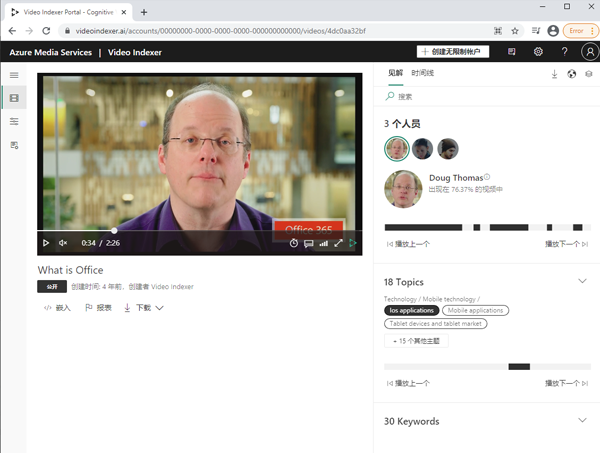
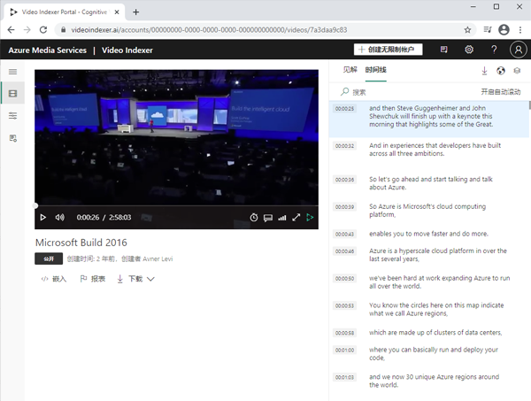
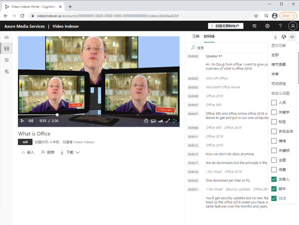
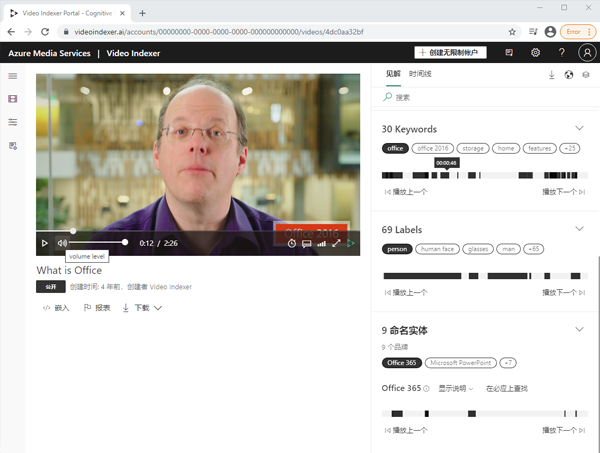
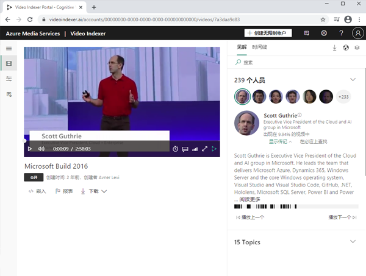
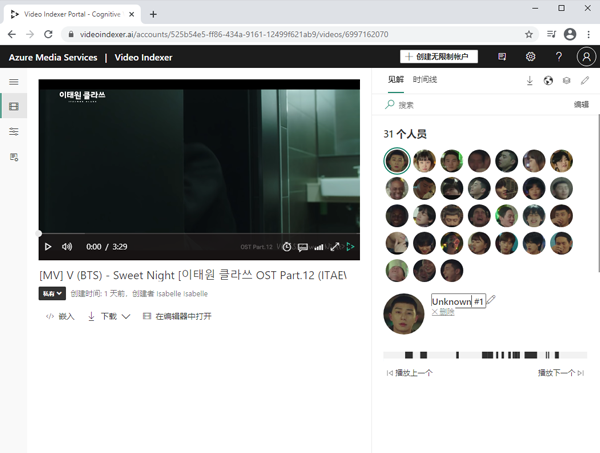
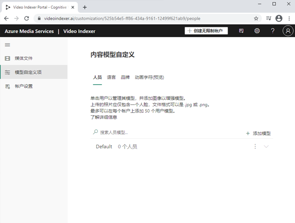
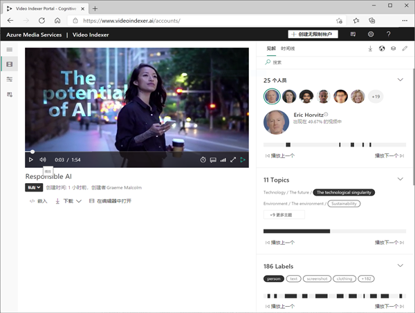

---
lab:
    title: '使用视频分析器分析视频'
    module: '模块 8 - 计算机视觉入门'
---

# 使用视频分析器分析视频

当今创建和使用的数据大都是视频格式数据。**媒体视频分析器**是一项 AI 助力的服务，可用于索引视频并从中提取见解。

## 克隆本课程的存储库

如果已将 **AI-102-AIEngineer** 代码存储库克隆到了要完成本实验室的环境，请在 Visual Studio Code 中将其打开；否则，请按照以下步骤立即将其克隆。

1. 启动 Visual Studio Code。
2. 打开面板 (SHIFT+CTRL+P) 并运行 **Git: Clone** 命令，将 `https://github.com/MicrosoftLearning/AI-102ZH-Designing-and-Implementing-a-Microsoft-Azure-AI-Solution` 存储库克隆到本地文件夹（具体克隆到哪个文件夹无关紧要）。
3. 克隆存储库后，在 Visual Studio Code 中打开文件夹。
4. 等待其他文件安装完毕，以支持存储库中的 C# 代码项目。

    > **备注**： 如果系统提示你添加生成和调试所需的资产，请选择 **“以后再说”**。

## 将视频上传到视频分析器

首先，你需要登录到视频分析器门户并上传视频。

> **提示**：如果在托管实验室环境中“视频分析器”页面加载速度缓慢，请使用本地安装的浏览器。可以切换回托管的 VM，以便执行后续任务。

1. 在浏览器中，通过以下链接打开视频分析器门户：`https://www.videoindexer.ai`。
2. 如果已有视频分析器帐户，请登录。如果没有，则注册一个免费帐户，并使用 Microsoft 帐户（或任何其他有效的帐户类型）登录。如果登录过程中遇到问题，请尝试打开专用浏览器会话。
3. 在视频分析器中，选择 **“上传”** 选项。然后，选择“输入文件 URL”选项，并输入 **`https://aka.ms/responsible-ai-video`**。将默认名称更改为 **“负责任的 AI”**，查看默认设置，选中复选框以验证 Microsoft 面部识别策略的合规性，并上传文件。
4. 文件上传后，等待几分钟，视频分析器随后会自动索引。

> **备注**： 在本练习中，我们将使用此视频来探索视频分析器的功能。但在完成练习后，你应该花点时间完整地观看此视频，因为其中包含用于负责任地开发支持 AI 的应用程序的有用信息和指导。 

## 查看视频见解

索引过程从视频中提取见解，你可以在门户中查看这些见解。

1. 在视频分析器门户中，索引视频后，选择该视频进行观看。你将在窗格旁边看到视频播放器，该窗格显示从视频中提取的见解。

2. 播放视频时，选择 **“时间线”** 选项卡以查看视频音频的字幕。

3. 在门户的右上角，选择 **“查看”** 符号（外观类似于 &#128455;），在见解列表中，除了 **“字幕”** 之外，还要选择 **“OCR”** 和 **“说话人”**。

4. 请注意，**“时间线”** 窗格现在包括：
    - 音频旁白字幕。
    - 在视频中可见的文本。
    - 视频中出现的说话人指示。有些知名人士会自动通过名字识别，其他人则用数字表示（例如*说话人 #1*）。
5. 切换回 **“见解”** 窗格并查看此处显示的见解。其中包括：
    - 视频中出现的个人。
    - 视频中讨论的主题。
    - 视频中出现的物体的标签。
    - 视频中出现的命名实体，例如人员和品牌。
    - 关键场景。
6. 在 **“见解”** 窗格可见的情况下，再次选择 **“查看”** 符号，并在见解列表中，将 **“关键字”** 和 **“情绪”** 添加到该窗格中。

    发现的见解可以帮助你确定视频中的主要主题。例如，此视频的**主题**表明，它显然与技术、社会责任和道德规范有关。

## 搜索见解

你可以使用视频分析器在视频中搜索见解。

1. 在 **“见解”** 窗格中的 **“搜索”** 框中，输入 **“蜜蜂”**。建议在“见解”窗格中向下滚动以查看所有见解类型的结果。
2. 注意，找到一个匹配的*标签*，位于下面视频中指示的位置。
3. 选择指示有蜜蜂存在的部分的开头，然后在该位置观看视频（建议暂停视频并仔细选择，蜜蜂只会短暂出现。）
4. 清除 **“搜索”** 框以显示视频中的所有见解。

## 编辑见解

可以使用视频分析器编辑找到的见解，并添加自定义信息以使视频更具意义。

1. 将视频倒回到开头，并查看 **“见解”** 窗格顶部列出**的人**员。查看已识别的一些人，包括计算机科学家兼 Microsoft 技术研究员 **Eric Horwitz**。

2. 选择 Eric Horwitz 的照片，然后查看其下方的信息，展开 **“显示传记”** 部分了解有关此人的信息。
3. 注意视频中指示此人出现的位置。你可以使用这些选项来观看视频的这些部分。
4. 在视频播放器中，找到在 0:34 左右说话的人：

5. 请注意，此人未被识别，并被分配了一个通用名称，例如**未知 #1**。但是，视频中确实包含带有此人姓名的字幕，因此我们可以通过编辑此人的详细信息来扩充见解。
6. 在门户的右上角，选择 **“编辑”** 图标 (&#x1F589;)。然后将未知人员的姓名更改为 **Natasha Crampton**。

7. 更改姓名后，请在 **“见解”** 窗格中搜索 *Natasha*。搜索结果应包括一个人，并指出他们出现在视频中的哪个部分。
8. 在门户的左上方，展开菜单 (&#8801;)，然后选择 **“模型自定义”** 页面。然后在 **“人员”** 选项卡上，查看 **“默认”** 人员模型中是否包含一个人。视频分析器已将指定的人添加到人员模型中，以便以后在帐户中索引的任何视频中都可以识别这些人。

可以将人员图像添加到默认人员模型，也可以添加自己的新模型。这样一来，你就可以定义带有脸部图像的人员的集合，以便视频分析器可以在视频中识别出他们。

还请注意，还可为语言（例如，指定要让视频分析器识别的行业特定术语）和品牌（例如公司或产品名称）创建自定义模型。

## 使用视频分析器小组件

视频分析器门户是用于管理视频索引项目的有用界面。但是，有时你可能想要将视频及其见解提供给无法访问视频分析器帐户的人员。为此，视频分析器提供了可嵌入到网页中的小组件。

1. 在 Visual Studio Code 中的 **16-video-indexer** 文件夹中，打开 **analyst-video.html**。这是一个基本的 HTML 页面，用于添加视频分析器播**放器**和**见解**小组件。请注意标题中对 **vb.widgets.mediator.js** 脚本的引用，此脚本使页面上的多个视频分析器小组件能够相互交互。
2. 在视频分析器门户中，返回到 **“媒体文件”** 页面并打开 **“负责任的 AI”** 视频。
3. 在视频播放器下，选择 **“&lt;/&gt; 嵌入”** 以查看 HTML Iframe 代码，以便能够嵌入小组件。
4. 在 **“共享和嵌入”** 对话框中，选择 **“播放器”** 小组件，将视频大小设置为 560 x 315，然后将嵌入代码复制到剪贴板。
5. 在 Visual Studio Code 中的 **analyze-video.html** 文件中，将复制的代码粘贴到注释 **“&lt;-- 此处是播放器小组件 -- &gt;”** 下。
6. 返回到 **“共享和嵌入”** 对话框，选择 **“见解”** 小组件，然后将嵌入代码复制到剪贴板。然后关闭 **“共享和嵌入”** 对话框，切换回 Visual Studio Code，并将复制的代码粘贴到注释 **“此处是见解小组件”** 下。
7. 保存文件。然后在 **“资源管理器”** 窗格中，右键单击 **“analyze-video.html”**，并选择 **“在文件资源管理器中显示”**。
8. 在文件资源管理器中，通过浏览器打开 **analyze-video.html** 以查看网页。
9. 对这些小组件进行试验，使用 **“见解”** 小组件来搜索见解，并在视频中跳转至这些见解。

## 使用视频分析器 REST API

视频分析器提供了一个 REST API，你可以使用该 API 上传和管理帐户中的视频。

### 获取 API 详细信息

要使用视频分析器 API，你需要一些信息以对请求进行验证：

1. 在视频分析器门户中，展开菜单 (≡) 并选择 **“帐户设置”** 页面。
2. 请记下此页面上的**帐户 ID**，稍后你将用到它。
3. 打开一个新的浏览器标签页，并前往位于 `https://api-portal.videoindexer.ai` 的视频分析器开发人员门户，使用视频分析器帐户的凭据登录。
4. 在 **“个人资料”** 页面上，查看与个人资料关联的**订阅**。
5. 在订阅页面上，注意已为每个订阅分配了两个密钥（主密钥和辅助密钥）。然后选择 **“显示”** 以查看任一密钥。稍后你需要用到该密钥。

### 使用 REST API

现在，你已经有了帐户 ID 和 API 密钥，接下来便可使用 REST API 来处理帐户中的视频。在此过程中，你将使用 PowerShell 脚本进行 REST 调用，但是相同的原理适用于 HTTP 实用程序（例如 cURL 或 Postman），或任何能够通过 HTTP 发送和接收 JSON 的编程语言。

与视频分析器 REST API 的所有交互都遵循相同的模式：

- 使用标头中的 API 密钥对 **AccessToken** 方法的初始请求用于获取访问令牌。
- 在调用 REST 方法以处理视频时，后续请求使用访问令牌进行验证。

1. 在 Visual Studio Code 的 **16-video-indexer** 文件夹中，打开 **get-videos.ps1**。
2. 在 PowerShell 脚本中，将 **YOUR_ACCOUNT_ID** 和 **YOUR_API_KEY** 占位符分别替换为之前标识的帐户 ID 和 API 密钥值。
3. 请注意，免费帐户的位置为“试用”**。如果创建了不受限制的视频分析器帐户（具有关联的 Azure 资源），则可以将此位置更改为预配置 Azure 资源的位置（例如“美国东部”）。
4. 查看脚本中的代码，请注意该脚本调用了两种 REST 方法：一种方法用于获取访问令牌，而另一种用于列出帐户中的视频。
5. 保存所做的更改，然后在脚本窗格的右上角使用 **&#9655;** 按钮运行脚本。
6. 查看来自 REST 服务的 JSON 响应，其中应包含之前索引的 **“负责任的 AI”** 视频的详细信息。

## 更多信息

有关**视频分析器**的详细信息，请参阅[视频分析器文档](https://docs.microsoft.com/azure/azure-video-analyzer/video-analyzer-for-media-docs/)。
