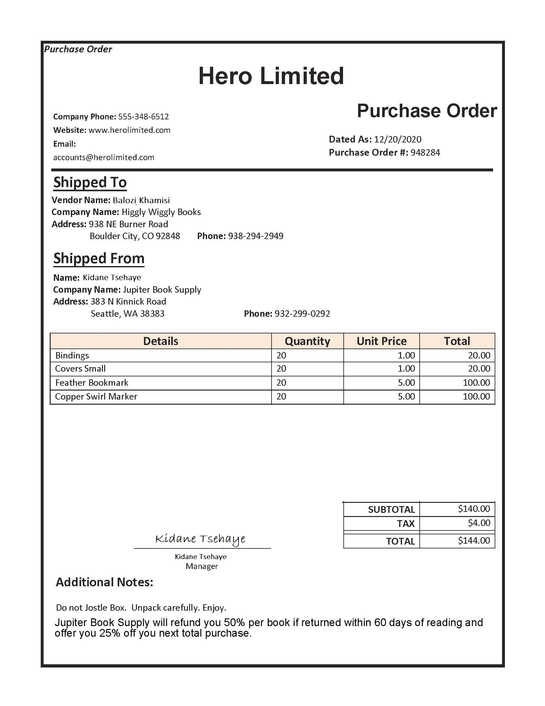

---
lab:
    title: '从表单中提取数据'
    module: '模块 11 - 读取图像和文档中的文本'
---

# 从表单中提取数据 

假设某公司需要自动进行数据条目处理。目前可能有一名员工人工读取采购订单并手动将数据输入数据库。你希望构建一个模型，使用机器学习来读取表单和可用于自动更新数据库的程序结构化数据。

**表单识别器**是一项认知服务，它让用户能够生成自动化数据处理软件。此软件可使用光学字符识别 (OCR) 从表单中提取文字、键值对和表。表单识别器有用于识别发票、收据和名片的预制模型。该服务还提供训练自定义模式的功能。在本练习中，我们将重点关注生成自定义模型。

## 克隆本课程的存储库

如果尚未克隆用于本课程的存储库，请克隆它：

1. 启动 Visual Studio Code。
2. 打开面板 (SHIFT+CTRL+P) 并运行 **Git: Clone** 命令，将 `https://github.com/MicrosoftLearning/AI-102ZH-Designing-and-Implementing-a-Microsoft-Azure-AI-Solution` 存储库克隆到本地文件夹（具体克隆到哪个文件夹无关紧要）。
3. 克隆存储库后，在 Visual Studio Code 中打开文件夹。
4. 等待其他文件安装完毕，以支持存储库中的 C# 代码项目。

    > **备注**： 如果系统提示你添加生成和调试所需的资产，请选择 **“以后再说”**。

## 创建表单识别器资源

要使用“表单识别器”服务，需在 Azure 订阅中创建“表单识别器”资源。使用 Azure 门户创建资源。

1.  打开 Azure 门户 `https://portal.azure.com`，使用与你的 Azure 订阅关联的 Microsoft 帐户登录。

2. 选择 **“&#65291;创建资源”** 按钮，搜索 *“表单识别器”*，并使用以下设置创建 **“表单识别器”** 资源：
    - **订阅**： *你的 Azure 订阅*
    - **资源组**： *选择或创建一个资源组（如果你使用的是受限订阅，则可能无权创建新资源组，在此情况下，可使用一个已提供的资源组）*
    - **区域**： *选择任何可用区域*
    - **名称**： *输入唯一名称*
    - **定价层**： F0

    > **备注**： 如果你的订阅中已有 F0 表单识别器服务，此项请选择 **“S0”**。

3. 部署资源后，转到该资源并查看其 **“密钥和终结点”** 页面。 稍后，需要使用此页面上的终**结点**和其中一个**密钥**来由代码管理访问。 

## 收集用于训练的文档

  

你将使用此存储库中 **21-custom-form/sample-forms** 文件夹内的示例表单，它包含不使用标签训练模型和使用标签训练模型所需的所有文件。

1. 在 Visual Studio Code 中，在 **21-custom-form** 文件夹中展开 **sample-forms** 文件夹。注意该文件夹中有以 **.json** 和 **.jpg** 结尾的文件。

    你将使用 **.jpg** 文件不使用标签训练第一个模型。__  

    稍后，你将使用以 **.json** 和 **.jpg** 结尾的文件，使用标签创建模型。**.json** 文件是预先生成的，包含标签信息。若要使用标签训练，你需要在 blob 存储容器中添加标签信息文件和表单。 

2. 返回到 Azure 门户 [https://portal.azure.com](https://portal.azure.com)。

3. 查看你之前在其中创建了表单识别器资源的**资源组**。

4. 记下资源组 **“概述”** 页上的 **“订阅 ID”** 和 **“位置”**。后续步骤中需要这些值和**资源组**名称。


5. 在 Visual Studio Code 中，在“Explorer”窗格中右键单击 **“21-custom-form”** 文件夹，并选择 **“在集成终端中打开”**。

6. 在终端窗格中，输入以下命令以与 Azure 订阅建立经认证的连接。
    
```
az login --output none
```

7. 根据提示登录到 Azure 订阅。然后返回 Visual Studio Code，等待登录过程完成。

8. 运行以下命令以列出 Azure 位置。

```
az account list-locations -o table
```

9. 在输出中，找到与资源组位置相对应的 **“名称”** 值（例如，对于*美国东部*，对应的名称是 *eastus*）。

    > **重要事项**： 记录该 **“名称”** 值并在步骤 12 中使用它。

10. 在“Explorer”窗格中，在 **21-custom-form** 文件夹中选择 **“setup.cmd”**。你将使用此批处理脚本来运行创建需要的其他 Azure 资源所需的 Azure 命令行接口 (CLI) 命令。

11. 在 **setup.cmd** 脚本中，查看 **rem** 命令。 这些注释概括了脚本将运行的程序。程序将会执行以下操作： 
    - 在 Azure 资源组中创建存储帐户
    - 将本地 sampleforms__ 文件夹中的文件上传到存储帐户中名为 sampleforms__ 的容器
    - 打印共享访问签名 URI

12. 使用你部署表单识别器资源时使用的订阅、资源组和位置名称对应的值，修改 **subscription_id**、 **resource_group** 和 **location** 变量声明。 
然后**保存**更改。

    为练习保留 **expiry_date** 变量的默认值。此变量在生成共享访问签名 (SAS) URI 时使用。实际操作时，应为 SAS 设置适当的到期日期。可以在[此处](https://docs.microsoft.com/azure/storage/common/storage-sas-overview#how-a-shared-access-signature-works)详细了解 SAS。  

13. 在 **21-custom-form** 文件夹的终端中，输入以下命令以运行脚本：

```
setup
```

14. 脚本完成后，查看显示的输出并记下你的 Azure 资源的 SAS URI。

> **重要事项**： 在继续操作之前，将 SAS URI 粘贴到稍后方便检索的位置（例如 Visual Studio Code 中的新文本文件中）。

15. 在 Azure 门户中，刷新资源组并验证它包含刚刚创建的 Azure 存储帐户。打开存储帐户，并在左侧窗格中选择“**存储浏览器（预览版）**”。在存储浏览器中，展开“**BLOB 容器**”并选择“**sampleforms**”容器以验证已从本地 **21-custom-form/sample-forms** 文件夹上传文件。

## 不使用标签训*练*模型

你将使用表单识别器 SDK 来训练和测试自定义模型。  

> **备注**： 在此练习中，可以选择在 **C#** 或 **Python** SDK 中使用 API。在下面的步骤中，请执行适用于你的语言首选项的操作。

1. 在 Visual Studio Code 中，根据你的语言首选项，在 **21-custom-form** 文件夹中展开 **C-Sharp** 或 **Python** 文件夹。
2. 右键单击 **train-model** 文件夹并打开集成终端。

3. 运行适用于你的语言首选项的命令，以安装“表单识别器”包。

**C#**

```
dotnet add package Azure.AI.FormRecognizer --version 3.0.0 
```

**Python**

```
pip install azure-ai-formrecognizer==3.0.0
```

3. 查看 **train-model** 文件夹的内容，注意它包含配置设置的文件：
    - **C#**： appsettings.json
    - **Python**： .env

4. 编辑配置文件，修改设置以反映以下信息：
    - 你的表单识别器资源的终**结点**。
    - 你的表单识别器资源的**密钥**。
    - 你的 blob 容器的 **SAS URI**。

5. 注意 **train-model** 文件夹包含客户端应用程序的代码文件：

    - **C#**： Program.cs
    - **Python**： train-model.py

    打开代码文件并查看其中包含的代码，并注意以下详细信息：
    - 你安装和导入的包中的命名空间
    - **Main** 函数会检索配置设置，并使用密钥和终结点来创建经身份验证的**客户**端。
    - 代码使用训练客户端，使用你的 blob 存储容器中的图像来训练模型，需使用你生成的 SAS URI 访问该存储容器。
    - 使用指示<u>不</u>应使用训练标签的参数来执行训练。表单识别器使用不*受监督*的技术从表单图像提取字段。

6. 返回 **train-model** 文件夹的集成终端，并输入以下命令以运行程序：

**C#**

```
dotnet run
```

**Python**

```
python train-model.py
```

7. 等待程序结束。然后在终端中查看模型输出并找到模型 ID。下一节程序中需要用到此值，因此请勿关闭终端。

## 测试未使用标签创建的模型

现在可以使用经训练的模型。注意你如何从来自存储容器 URI 的文件训练了模型。还可使用本地文件训练模型。类似地，可以使用来自 URI 或本地文件的表单来测试模型。你将使用本地文件测试表单模型。

获得模型 ID 后，可从客户端应用程序使用它。同样，可以选择使用 **C#** 或 **Python**。

1. 在 **21-custom-form** 文件夹中，在你的语言首选项（**C-Sharp** 或 **Python**）的子文件夹中，展开 **test-model** 文件夹。
2. 右键单击 **test-model** 文件夹并打开集成终端。 现在，你拥有（至少）两个 **cmd** 终端，可使用“终端”窗格中的下拉列表在其间切换。
3. 在 **test-model** 文件夹的终端中，运行适用于你的语言首选项的命令，以安装“表单识别器”包。

**C#**

```
dotnet add package Azure.AI.FormRecognizer --version 3.0.0 
```

**Python**

```
pip install azure-ai-formrecognizer==3.0.0
```

*如果你之前使用 pip 将该包安装到 Python 环境中，则此步骤并非必需，但确定已安装它没有坏处。*

4. 在 **test-model** 文件夹中，编辑配置文件（**appsettings.json** 或 **.env**，具体取决于你的语言首选项）以添加以下值：
    - 你的表单识别器终结点。
    - 你的表单识别器密钥。
    - 训练模型时生成的模型 ID（可将终端切换回 **train-model** 文件夹的 **cmd** 控制台）。

5. 在 *test-model* 文件夹中，打开客户端应用程序的代码文件（对 C# 而言是 *Program.cs*，对 Python 而言是 *test-model.py*）并查看它包含的代码，注意以下详细信息：
    - 已导入你安装的包中的命名空间
    - **Main** 函数会检索配置设置，并使用密钥和终结点来创建经身份验证的**客户**端。
    - 然后使用该客户端从 **test1.jpg** 图像中提取表单域或值。
    
6. 返回 **test-model** 文件夹的集成终端，并输入以下命令以运行程序：

**C#**

```
dotnet run
```

**Python**

```
python test-model.py
```

7. 查看输出，并注意预测置信度分数。注意输出提供 field-1、field-2 等字段名称。 

## 使用客户端库，使用标签训练*模*型

假设你使用发票表单训练模型后，想要了解使用带标签的数据训练的模型的性能。不使用标签训练模型时，你只使用了来自 Azure blob 容器的 **.jpg** 表单。现在，你将使用 **.jpg** 和 **.json** 文件训练模型。

1. 在 Visual Studio Code 中，在 **21-custom-form/sample-forms**文件夹中打开 **fields.json**，并查看它包含的 JSON 文档。此文件定义了你要训练模型从表单中提取的字段。
2. 打开 **Form_1.jpg.labels.json** 并查看它包含的 JSON。此文件标识了 **Form_1.jpg** 训练文档中的命名字段的位置和值。
3. 打开 **Form_1.jpg.ocr.json** 并查看它包含的 JSON。此文件包含 **Form_1.jpg** 的文本布局（包括表单中所有文本区域的位置）的 JSON 表示形式。

    *在此练习中，我们为你提供了字段信息文件。对于你自己的项目，可以使用[示例标签工具](https://docs.microsoft.com/azure/cognitive-services/form-recognizer/label-tool)创建这些文件。使用该工具时，将自动创建字段信息文件并存储到连接的存储帐户。*

4. 在 **train-model** 文件夹中，打开训练应用程序的代码文件：

    - **C#**： Program.cs
    - **Python**： train-model.py

5. 在 **Main** 函数中，找到注释 **“Train model”**，进行如下所示的修改以更改训练过程，以便使用标签：

**C#**

```C#
// Train model 
CustomFormModel model = await trainingClient
.StartTrainingAsync(new Uri(trainingStorageUri), useTrainingLabels: true)
.WaitForCompletionAsync();
```

**Python**

```Python
# Train model 
poller = form_training_client.begin_training(trainingDataUrl, use_training_labels=True)
model = poller.result()
```

6. 返回 **train-model** 文件夹的集成终端，并输入以下命令以运行程序：

**C#**

```
dotnet run
```

**Python**

```
python train-model.py
```

10. 等待程序结束，然后查看模型输出。
11. 记下终端输出中的新模型 ID。 

## 测试使用标签创建的模型

1. 在 **test-model** 文件夹中，编辑配置文件（**appsettings.json** 或 **.env**，具体取决于你的语言首选项）并更新它以反映新模型 ID。保存更改。
2. 返回 **test-model** 文件夹的集成终端，并输入以下命令以运行程序：

**C#**

```
dotnet run
```

**Python**

```
python test-model.py
```
    
3. 查看输出，并观察这一现象：使用标签训练的**模**型的输出提供“CompanyPhoneNumber”和“DatedAs”等字段名称，**与不使**用标签训练的模型的输出不同（它生成了 field-1、field-2 等输出）。  

虽然使用标签训练模型的代码和不使用标签训练模型的代码差异可能不大，但从二者中选择其一确实会改变项目计划需求______。若要使用标签进行训练，则需[创建带标签的文件](https://docs.microsoft.com/azure/cognitive-services/form-recognizer/quickstarts/label-tool?tabs=v2-0)。训练过程的选择还会产生不同的模型，进而会根据模型返回的字段和返回结果的置信度影响下游过程。 

## 更多信息

有关表单识别器服务的详细信息，请参阅[表单识别器文档](https://docs.microsoft.com/azure/cognitive-services/form-recognizer/)。
